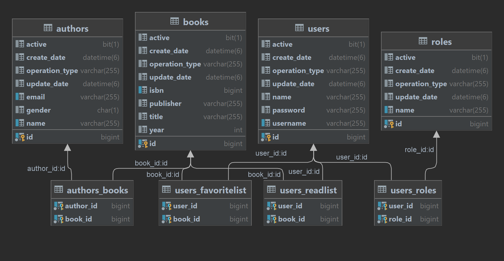
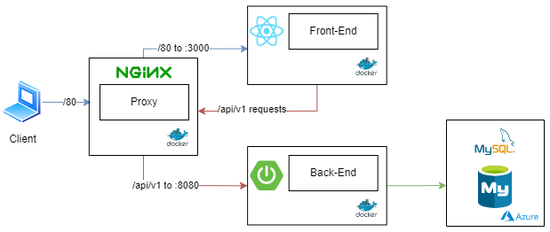

# Book Portal

## Build Status

[](https://github.com/ugurcanerdogan/BookPortal/actions/workflows/node.js.yml)

[](https://github.com/ugurcanerdogan/BookPortal/actions/workflows/maven.yml)

[](https://github.com/ugurcanerdogan/BookPortal/actions/workflows/ec2.yml)

## Project title
Book Portal 📚 using React and Spring Boot

### Motivation
Create a project with front-end and back-end to run easily locally or through the browser with the help of AWS EC2 and Docker

## Solution

### Database diagram


### Architecture


#### Layered Architecture Style

The layered architecture, also known as the n-tiered architecture style, is one of the most common architecture styles. This style of architecture is the de facto standard for most applications, primarily because of its simplicity, familiarity, and low cost. It is also a very natural way to develop applications due to Conway’s law, which states that organizations that design systems are constrained to produce designs which are copies of the communication structures of these organizations. In most organizations there are user interface (UI) developers, backend developers, rules developers, and database experts (DBAs). These organizational layers fit nicely into the tiers of a traditional layered architecture, making it a natural choice for many business applications. The layered architecture style also falls into several architectural anti-patterns, including the architecture by implication anti-pattern and the accidental architecture anti-pattern. If a developer or architect is unsure which architecture style they are using, or if an Agile development team “just starts coding,” chances are good that it is the layered architecture style they are implementing. (Mark Richards, Neal Ford)


<hr>

### Tech / Framework used


- JavaScript
- React
- Semantic UI
- GitHub actions


- Java 18
- Spring Boot
- Spring
- Hibernate - JPA
- Swagger
- GitHub actions

#### Back-end code style

[Java Code Conventions](https://www.oracle.com/java/technologies/javase/codeconventions-contents.html)
<hr>

## Installation

### How to use it?

#### Docker

You will need Docker and Docker-Compose plugin.

#### GitHub

Steps

1. Clone the repo https://github.com/ugurcanerdogan/BookPortal
2. Go to the project folder
3. Type ``` docker-compose up ``` for creating containers and run them
4. Voilà app up and running !

### References

- https://luizcostatech.medium.com/how-to-dockerize-spring-boot-react-apps-1a4aea1acc44
- https://turkogluc.com/run-react-and-spring-docker-compose/
- https://github.com/Semantic-Org/Semantic-UI/issues/7073
- https://github.com/luizgustavocosta/16-bits-zero-to-hero/blob/main/README.md

<hr>

### License

+ [MIT](https://choosealicense.com/licenses/mit/)
